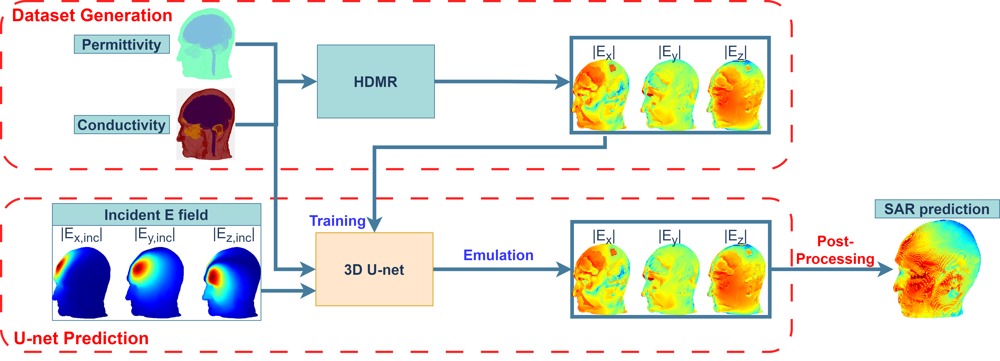

# Deep Learning-Based Prediction of Specific Absorption Rate Induced by Ultra-High-Field MRI RF Head Coil

This repository provides an implementation of [a deep learning-based method for predicting SAR distributions in human head models](https://ieeexplore.ieee.org/document/10955187), developed using Python 3, Keras, and TensorFlow. The model leverages 3D U-Net and its variants to predict 3D SAR distributions from head tissue properties—specifically conductivity and permittivity—and the incident E-field.



## Requirements
- Python 3.7
- TensorFlow 2.11.0
- Keras 2.11.0

## Code Structure

0.  All files referenced below can be found [here](https://drive.google.com/drive/folders/1X0PezIlg--sGqLzdGbzWC3Psr_5r8Piz).

1. **Model and Data Loader**  
	- The U-Net model and its variants are located in the `unetmodel` directory.  
	- The `dataloader` directory contains modules related to data loading.

2. **Training**
	- Use `training_script.py` with `Dataloader.py`, `argparser.py`, and `settings.py` for training from scratch.  
	- Define `X_DATA_PATH` and `Y_DATA_PATH` in `settings.py` to specify the input and output data directories. All data points should be placed in a single directory for random partitioning.
	- Data partitioning is performed based on "head models" rather than individual data points.
	- The parameter `num_files_per_model` in `Dataloader.py` determines how many files are associated with each head model and ensures that all files related to the same model are consistently assigned to either training, validation, or testing sets.
	- The flag `input_with_E_inc` in `settings.py` specifies whether the [incident E-field](https://drive.google.com/file/d/1oJeuXd58RAO-PFKJLaSBPhvs67r4dX9T/) is included as part of the network input. If disabled, make sure to update the `NUMBER_INPUT_CHANNELS` parameter accordingly.

3. **Transfer Learning**
   - Use `training_script_transfer.py` in combination with `Dataloader_folder.py`, `argparser_transfer.py`, and `settings_transfer.py` for transfer learning tasks.
   - In this setup, no random partitioning is applied. Instead, training, validation, and testing data should be organized into separate folders beforehand.
   - A [base model](https://drive.google.com/drive/u/6/folders/1ABs5BAoyndzQ-R_BSueGacyLxYogJXMy) based on 3D Attention U-net is provided for use in transfer learning. Modify `model_folder`  to the  corresponding directory containing the base model.

5. **Prediction and Evaluation**  
	- A [pre-trained model](https://drive.google.com/drive/folders/1Qljd70njLiZq6ZpL0N5vzB_B9NCsjxjX) based on the 3D Attention U-Net, along with a few [input](https://drive.google.com/drive/folders/1zXiicbGBpRQegvpmvLLGJgpaxdTmrI7r) and [output](https://drive.google.com/drive/folders/1d6lj24RLgnywht4wfmmoTkknD9Yrfmkq) samples, is provided for evaluation purposes.
	- To perform testing, update `model_folder` to the correct directory containing the pre-trained model, and set `X_DATA_PATH` and `Y_DATA_PATH` in `settings.py` accordingly.
	- Use `test_predicting_on_sample.py` to perform inference on a single data point.


## Citation

```
@ARTICLE{MRI-SAR-Unet,
  author={Wang, Xi and Jia, Xiaofan and Huang, Shao Ying and Yucel, Abdulkadir C.},
  journal={IEEE Journal of Electromagnetics, RF and Microwaves in Medicine and Biology}, 
  title={{Deep Learning-Based Prediction of Specific Absorption Rate Induced by Ultra-High-Field MRI RF Head Coil}, 
  year={2025},
  volume={},
  number={},
  pages={1-14},
  doi={10.1109/JERM.2025.3555236}
}
```

## Acknowledgement

Developed based on [IntelAI-Unet](https://github.com/intel/unet/) and [DeeptDCS](https://github.com/jxf0623/DeeptDCS/).
